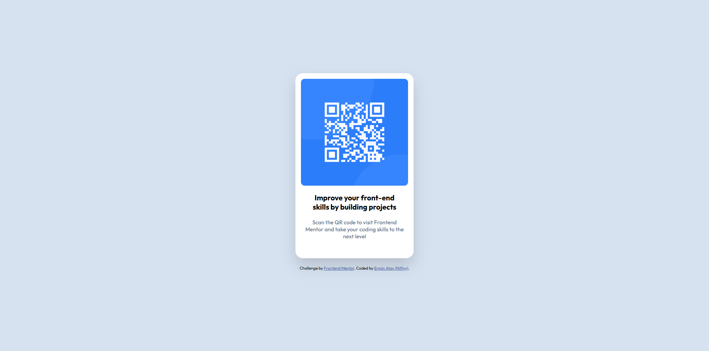

# Frontend Mentor - QR Code Component Solution

This is a solution to the [QR code component challenge on Frontend Mentor](https://www.frontendmentor.io/challenges/qr-code-component-iA_BxValidation). Frontend Mentor challenges help you improve your coding skills by building realistic projects.

## Table of contents

- [Overview](#overview)
  - [Screenshot](#screenshot)
  - [Links](#links)
- [My process](#my-process)
  - [Built with](#built-with)
  - [What I learned](#what-i-learned)
- [Author](#author)

---

## Overview

### Screenshot



### Links

- **Solution URL:** [GitHub Repository](https://github.com/ErgunAtay/qr-code-component)
- **Live Site URL:** [Live Demo](https://YOUR_SITE_NAME.netlify.app)

---

## My process

### Built with

- Semantic HTML5 markup
- CSS custom properties & Flexbox
- Mobile-first workflow

### What I learned

In this project, I practiced building a semantic HTML structure and centering elements vertically and horizontally using CSS Flexbox.

```css
body {
  display: flex;
  justify-content: center;
  align-items: center;
  min-height: 100vh;
}
```
